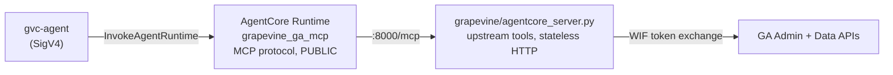

# Grapevine deployment

This fork runs Google's Analytics MCP server on **Bedrock AgentCore Runtime** in
the Grapevine AWS account. Everything Grapevine-specific lives here, in
`infra/`, and in `.github/workflows/grapevine-*.yml`. Upstream files are
unchanged apart from a `[tool.setuptools.packages.find]` block appended to
`pyproject.toml`, so upstream merges stay clean:

```shell
git fetch upstream && git merge upstream/main
```

## How it runs



- `agentcore_server.py` serves upstream's `analytics_mcp.coordinator.app` as
  stateless streamable HTTP with plain JSON responses on `0.0.0.0:8000/mcp`
  (AgentCore's MCP contract). `/ping` is a health check.
- `credentials.py` picks Google credentials from the environment:
  - `GOOGLE_WIF_AUDIENCE` + `GOOGLE_SERVICE_ACCOUNT_EMAIL`: keyless Workload
    Identity Federation from the runtime's AWS role (preferred).
  - `GOOGLE_CREDENTIALS_SECRET_ARN`: a service account key in Secrets Manager.
  - neither: upstream's Application Default Credentials (local use).
- No VPC: the server only calls Google's public APIs, and a VPC attachment can
  never be removed from an AgentCore runtime.
- Inbound auth is IAM. Callers need `bedrock-agentcore:InvokeAgentRuntime` on
  the runtime. Cross-account callers (gvc-agent, still in the Bizantic account)
  assume the `grapevine-ga-mcp-invoker` role created when `InvokerPrincipalArns` is
  set.
- Upstream reports tool failures as a normal result whose text is
  `{"error": "..."}` (with `isError: false`), so clients must check for it.

## Deploying

1. One-time: `infra/bootstrap.yaml` is deployed as stack `grapevine-bootstrap`
   (OIDC provider, `grapevine-ga-mcp-deploy` role, CloudTrail, budget). Set its
   `DeployRoleArn` output as the repo secret `AWS_DEPLOY_ROLE_ARN`.
2. Run **Grapevine deploy** (Actions → workflow_dispatch). It deploys
   `grapevine/ecr.yaml`, pushes the arm64 image, deploys
   `grapevine/template.yaml`, and prints the invocations URL. Inputs are only
   applied when set, so a plain run ships a new image without touching the
   Google or invoker settings.

## Google setup (one-time)

1. In the GCP project, enable the Analytics Admin API and the Analytics Data
   API.
2. Create a service account, e.g. `ga-mcp@<project>.iam.gserviceaccount.com`,
   and add it as **Viewer** on the GA4 property (GA Admin → Property access
   management).
3. Create a workload identity pool with an **AWS** provider for the Grapevine
   account ID, and let the runtime role
   (`arn:aws:sts::<account>:assumed-role/grapevine-ga-mcp-runtime/*`) impersonate the
   service account (`roles/iam.workloadIdentityUser` on the pool principal set
   filtered by `attribute.aws_role`).
4. Re-run the deploy with `google_wif_audience` and
   `google_service_account_email`.

## Local

```shell
python -m venv .venv && .venv/bin/pip install -e . -r grapevine/requirements.txt
gcloud auth application-default login \
  --scopes https://www.googleapis.com/auth/analytics.readonly,https://www.googleapis.com/auth/cloud-platform
.venv/bin/python -m grapevine.agentcore_server          # HTTP on :8000/mcp
.venv/bin/python -m unittest discover -s grapevine/tests -t . -p 'test_*.py'
```

The upstream stdio server (`analytics-mcp`) still works for Claude Code or
Desktop with the same ADC login.
